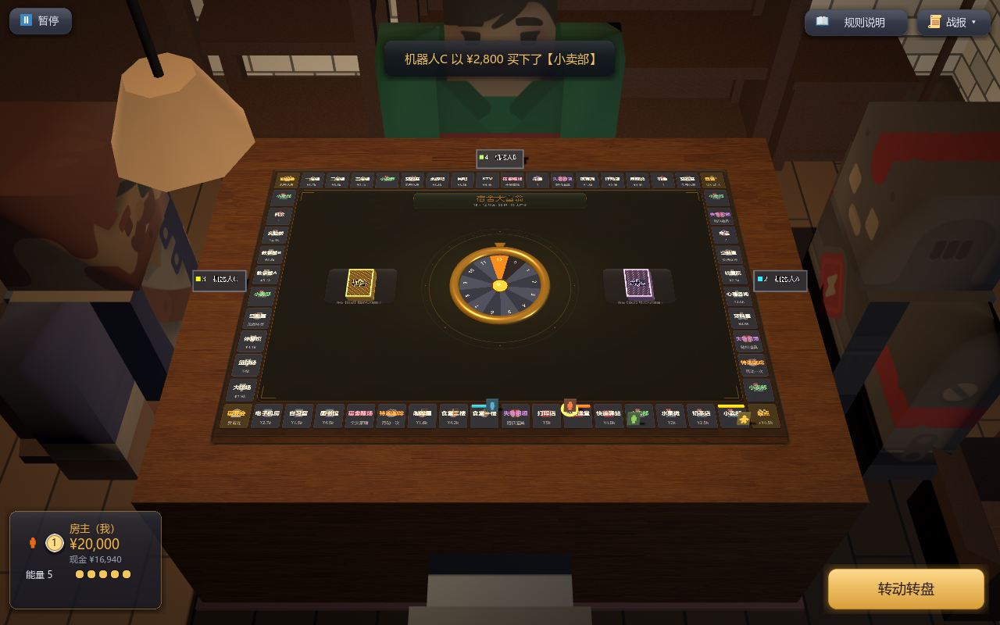
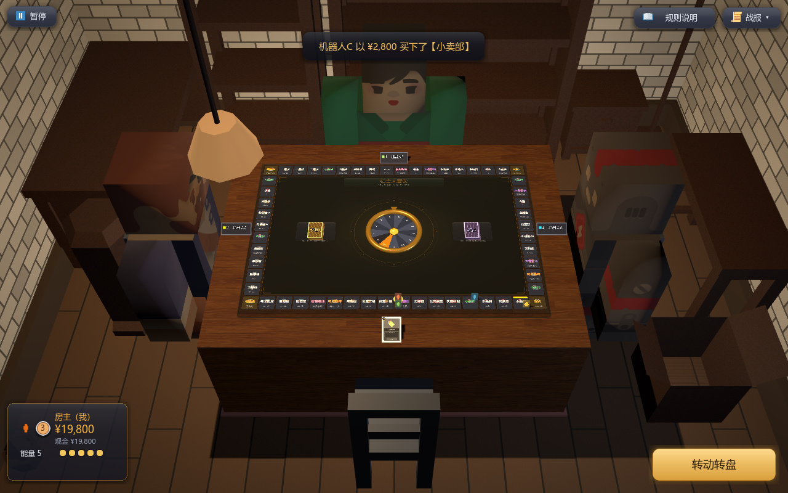
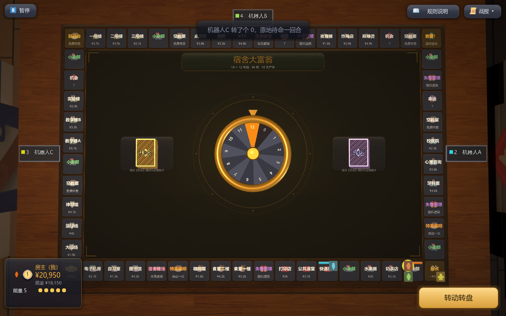
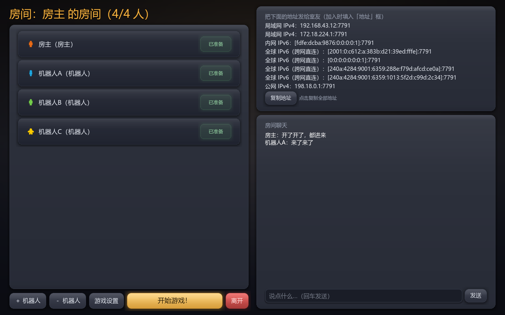

# 宿舍大富翁

宿舍主题的大富翁棋牌游戏，用 **Godot 4.6** 制作。

**56 格宿舍地图铺在一张木纹桌面上，而这张桌子就在一间宿舍里** —— 砖墙、木条地板、靠墙的家具、
头顶一盏吊灯，你和三个室友各自坐在一边。滚轮在「**3D 围桌**」与「**2D 桌面**」之间连续推移视角
（3D 端 **Ctrl+滚轮**推近 / 拉远），棋盘中央的转盘决定步数，买地、装修、收租、抽事件卡，
**30 轮后身家最高**或**活到最后**者赢。

支持 **同一局域网 4 人联机**（自动搜索房间）与 **IPv6 / IPv4 直连**（跨校园网也能玩），
也支持**纯单机**（房主 + 机器人，同一套代码）。界面与音效全部运行时程序化绘制 / 合成，
另引用少量开源素材，授权见根目录 `LICENSE`。

## 截图

| | |
|---|---|
| <br>**3D 围桌（默认档）**：棋盘铺在桌垫上、四家各坐一边；每人对应的桌沿立着**一块名牌**（名次 + 棋子色 + 昵称），**点它**开该玩家的道具弹窗 | <br>**`Ctrl`+滚轮拉远**「看屋子」那一档：砖墙、木条地板、两侧家具与头顶的吊灯都进画 |
| <br>**2D 桌面**（滚轮推到底）：近正俯视读棋盘、字最大；桌上的名牌自动**平贴桌面** | <br>**大厅**：准备 / 加机器人 / 游戏设置 / 一键复制各种直连地址 / 聊天 |

## 怎么运行

1. 安装 [Godot 4.6.2](https://godotengine.org/download)（`project.godot` 声明 `features=4.6`，低版本编辑器打不开；本项目用 4.6.2 开发）。
2. 双击仓库根目录的 `start.bat` 启动（会自动找 Godot；也可 `start.bat "Godot.exe路径"` 指定）；
   或者用 Godot 编辑器打开本目录的 `project.godot` 按 **F5** 运行；
   或者用命令行：`Godot.exe --path "本目录"`。
3. 想给室友发独立程序：用 Godot 编辑器「项目 → 导出」导出 Windows 可执行文件即可。

> 第一次联机时 Windows 防火墙可能弹窗，请选择「允许访问」（专用网络即可）。

## 怎么联机

### 同一宿舍 / 同一局域网（推荐）

1. 房主点「**创建房间**」。
2. 其他人在主菜单的「局域网房间」列表里就能看到房间，点「加入」；
   搜不到时（路由器开了 AP 隔离等）在「地址」框里填房主大厅里的
   **局域网 IPv4**（大厅里可一键复制），例如 `10.11.28.88`。
   搜索同时会发全网广播、各网段定向广播和本机回环，同机双开也能互相搜到。
3. 人齐（2~4 人）或补上机器人，全部点「准备」，房主点「开始游戏！」。
   房间列表会标注「已满 / 游戏中」，这类房间不可再加入。

### IPv6 / IPv4 直连（跨网络）

1. 房主在大厅里点「复制地址」，把 **全球 IPv6 地址**（形如 `2001:da8:…`，教育网基本都有）发给朋友。
2. 朋友在「地址」框直接粘贴，点「加入」。支持这些写法：
   - `2001:da8::1234`
   - `[2001:da8::1234]:7800`（自定义端口）
   - `10.11.28.88:7800`（IPv4 加端口）
   - 域名
3. 服务端是 **IPv4 + IPv6 双栈**：一个房间里可以同时有局域网玩家和 IPv6 直连玩家。

直连要求：双方都有公网 IPv6（测试：浏览器打开 test-ipv6.com 能通），
且防火墙放行了游戏端口（默认 **7777/TCP**）。

### 机器人

房主可以在大厅「＋机器人」补位到 4 人，掉线的玩家会自动被机器人接管
（包括他正弹着的购买/装修询问，立刻按机器人策略替他决定，不会全场干等）。
真人发呆 35 秒没掷骰，系统会代掷一步，避免整局卡住（35 秒为默认档，随房主「操作限时」挡位，见 `doc/game-design/开局设置.md` §三之一）。
机器人策略很朴实：钱多就买房装修，穷就苟着。

## 玩法规则（宿舍魔改版）

- **56 格环形棋盘**（18×12 外圈、30 块地产），每人初始 **¥20,000**，
  每次踏上「起点」领工资 **¥4,500**。
- **棋盘中央的赌场风转盘决定步数（0~12）**：转到 **12 满值**奖励再动一次；
  **连续三次转到 10+** 会被「查寝」押进「宿委会」反省一回合；转到 **0** 原地待命一回合。
- 落在无主地产可购买；落在自己的地产可花钱**装修**（Lv1~Lv4，费用为地价一半）。
- 租金 = 基础租金 × (1 + 装修等级)。**30 块地彼此独立，没有「集齐成套再翻倍」**。路过别人的地自动扣款。
- 「机会 / 命运」格抽宿舍事件卡：奖学金、查寝、请客奶茶、过生日收红包、共享单车快进……
  仿实体桌游，两副牌堆就摆在棋盘中央；抽卡**在屏幕正中以大字演**（相机不动）。
- **「宿舍赌场」格（2 个）**：踩到后全员各掏 ¥800 入局玩小游戏，赢家通吃奖池。
  进入时**整屏切进独立的赌场场景**（触发时独占，离开回桌），随后**CSGO 开箱式抽游戏**，
  场景变为本局要玩的那个游戏。
  当前小游戏「**投骰子**」：**每人同时掷一颗 6 面骰，点数最大者通吃**（平局并列者平分）；
  机器人自动玩、破产者观战。
- 「失物招领」4 格随机捡一件道具，「特浓咖啡」2 格可**再行动一次**；
  「空教室 / 卧谈会」免费休息。
- **开局**：房主可调一套经济 / 节奏 / 胜利 / 道具设置（`开局设置.md`），并可开「开局科技」——
  发车前每人私密三选一（`开局科技.md`）。
- 付不起钱即破产，名下地产充公、道具清空；**活到最后**，或 **30 轮后总资产最高**者获胜。

## 操作与表现

- **一间宿舍**：地板 / 天花板 / 四面墙 / 靠墙家具（书桌 / 书架 / 收纳入柜 / 边柜 / 落地灯 / 盆栽…）
  / 桌下一块地毯 / 头顶一盏**看得见的吊灯**。房间**只在 3D 端**看得见（2D 端是近正俯视，
  屋子与吊灯都退出画外），**读棋盘时不受它打扰**。
- **四个人坐在四把椅子上**（3D 模型坐姿）；**完全静止**（不做待机小动作 —— 免得"乱动"读起来像卡了）。
  四个玩法事件各有**一动**：出牌伸手、付钱、被抢地摇头、破产**歪倒在座位上**。
- **桌上每人一块名牌**（其余三家；自己那侧不出人 = 相机所在）：名次 + 棋子色小片 + 昵称 +
  轮到谁时的倒计时条。**点它**开该玩家的**道具弹窗**（公开背包 / 能量 / 身家名次）；
  指向性道具选目标就是**点对手那块名牌**（可选中的描金边），也支持**按住手牌拖出一条瞄准箭头**
  拖到目标上松手。名牌**整块正对镜头**，2D 端自动平贴桌面。
- **视角固定**：相机恒在你自己的座位，不旋转。滚轮在 **3D 围桌** 与 **2D 桌面** 之间推移
  （3D 端手里有牌、2D 端手牌看不见也点不到）；3D 端 **`Ctrl`+滚轮**推近 / 拉远，
  **默认那档是「看屋子」**（格里的字最小），**读棋盘请推近或换 2D**。
  轮到谁行动镜头自动跟到谁，行动棋子带脉冲光环。
- **棋子（小人）与装修房子是立着的实物**：小人和房子薄牌**站在自己那一格上**；
  **悬停任一棋子**，它上方浮出一条面向镜头的信息条（昵称 / 身家 / 名次），移开即收。
- **回合分两阶段**：① 转轮盘 → ② 使用道具；操作按钮在**屏幕右下角**（掷轮时「转动转盘」、
  掷完进道具阶段变「结束回合」）；出牌是**点自己面前那张手牌直接使用**（需要选目标的再点目标）。
- **左下角是你自己的身家条**：名次徽章 + 名字 + 身家（大字）+ 现金 + **能量（体力）**读数与小格。
- 右上角是**战报与聊天**悬浮栏（头部带当前轮次，新战报会让头部闪一记金色，点「战报」可收起）；
  **右上角「📖 规则说明」**展开分页规则面板（基础操作 / 回合与行动 / 棋盘与地产 / 经济与胜负 /
  道具与事件），与「战报」互斥，文案与 `doc/game-design/*` 同步、数值直接引用代码常量。
- **左上角「⏸ 暂停」**：暂停菜单（设置音量、退出二次确认）；
  **联机时只有房主打开菜单才会全场暂停**，其他人只看到「房主已暂停」遮罩。
- **「畸变生效中」横幅**在屏幕顶部水平居中，显示生效中的畸变与剩余回合数。
- 金额变动：棋盘上飘字（涨绿跌红），账单在棋子与该玩家的身家条之间**飞进飞出**。
- **点棋盘格子弹出详情卡**：产业组 / 售价 / 当前租金 / 装修等级 / 持有者，边框随产业组变色。
- 抽卡演出**在屏幕层正中以固定大字演**（**相机全程不动**）：卡背弹出 → 绕竖轴翻面亮出卡面
  → 停留浮动 → 收回；查寝、破产伴随震屏与音效。
- 画面质感：桌面木纹 + 暗角，棋盘铺在**深绿绒面嵌板**上（描金边 + 四角金括号 + 同心圆刻度）；
  HUD 入场错落淡入，按钮挂 Twemoji 图标；**4× MSAA** 抗锯齿。
- 全部音效为运行时程序合成（`fx.gd`），无外部素材。
- **开发者模式**：对局内按 **F1** 或启动加 `--dev` —— 左侧调试面板提供实时状态、改钱、
  发放/强制使用道具、体力与冷却、传送、强制点数、结束当前等待、0.25~8 倍时间倍率等。
  另有**道具试验场**（`--lab`）：道具效果的独立沙盒，见 `doc/development/道具试验场.md`。

## 项目结构

```
project.godot          引擎配置（GL Compatibility 渲染 + 4x MSAA，窗口 1280×800）
theme.tres             全局主题（SystemFont 中文字体：雅黑/苹方/思源黑）
start.bat              Windows 双击启动（自动查找 Godot；首次或脚本类名变动时自动 --import）
export_presets.cfg     Windows 导出预设（custom_template 留空 = 用编辑器模板目录，换机器装好模板即可）
build/                 打包产物（DormMonopoly.exe 单文件 + zip 分发包）；已 gitignore
shots/                 截图产物（--shot= 的输出目录，不是源码）；已 gitignore
scenes/                main_menu / lobby / game / item_lab 四个场景（根节点，UI 代码构建）
scripts/
  net.gd               自动加载：ENet 联机、大厅名册与聊天、UDP 广播搜索房间
  net_addr.gd          纯函数地址工具：地址解析/展示、发现报文解析（可单测）
  game_data.gd         56 格棋盘生成、事件卡、租金/路径/几何等纯规则（可单测）
  game_settings.gd     开局设置：房主可调的经济/节奏/胜利/道具/特殊项
  item_data.gd         道具数据总表（品质/体力/冷却/唯一性；台账见 doc/game-design/道具系统.md）
  tech_data.gd         开局科技数据（三选一，池与档位）
  aberration_data.gd   畸变数据（全场事件）
  item_card.gd         道具卡面控件（图鉴 / 货架 / 使用展示共用）
  game.gd              对局场景：房主权威回合状态机 + 全员状态同步 + HUD + 小游戏
  table_hud.gd         对局 HUD 与暂停菜单族的控件构建（构建器，写回 game 同名成员）
  rules_text.gd        规则说明文案（分页正文；数值直接引用代码常量，不写死）
  rules_panel.gd       规则说明面板（右上角「📖 规则说明」展开 / 换页，与战报互斥）
  table_3d.gd          3D 桌面：相机（3D↔2D 推移 + 推拉）、光照契约、输入映射到画布像素
  table_props.gd       桌上实物：转盘 / 手牌 / 棋子和房子薄牌 / 两摞牌堆 / **对手名牌**
  table_geometry.gd    世界坐标 ↔ 画布像素 ↔ 屏幕的换算（纯函数）
  room.gd              3D 房间：地板/墙/天花板、靠墙家具、程序化木地板与砖墙、吊灯
  chars.gd             坐在椅子上的四个人（手摆坐姿 + 四个事件的一动；完全静止）
  board_view.gd        大棋盘渲染、缩放/跟随镜头
  deck_reveal.gd       屏幕层抽卡大字演出（固定居中，相机不动）
  aim_arrow.gd         屏幕层瞄准箭头（按住手牌拖向目标）
  player_popup.gd      玩家道具弹窗（点名牌 / 自己的身家条打开：公开背包 / 能量）
  wheel_view.gd        棋盘中央 13 格转轮（0~12 点数来源）
  casino.gd            赌场小游戏场景（触发时独占）
  fx.gd                自动加载：程序合成音效、场景淡入淡出、震屏、飘字、彩带
  main_menu.gd         主菜单（昵称、创建/加入、房间搜索）
  lobby.gd             大厅（准备、机器人、直连地址一键复制、聊天）
  ui_kit.gd            控件样式小工具（程序化九宫格渐变纹理 / 氛围背景 / 素材加载）
  dev_tools.gd         自动化开关与摆拍（--autotest / --shot / --fps / --lab 等）
  item_lab.gd          道具试验场场景（--lab）：道具效果沙盒的界面与状态注入
  lab_case.gd          道具试验场的用例数据（供沙盒逐件验证）
assets/                开源素材（授权与来源见根目录 LICENSE）
  pieces/              Kenney 桌游棋子（CC0）：玩家棋子与头像
  icons/               Twemoji 图标（CC-BY 4.0）：格子水印图标 + HUD 图标（ui_*）
  textures/            ambientCG 木纹（CC0）：棋盘桌面
  models/              Kenney 家具包 + Blocky Characters（CC0）：3D 房间的家具与人物
  cards/               机会 / 命运牌的卡背（Wikimedia「Atlas deck」，CC0）
doc/                   设计文档与原型（.md 为活文档，.html/.drawio 为定稿原型）
  game-design/         玩法设计：机制与数值、道具图鉴、设计决策留痕
    prototype/         交互原型存档（.html/.drawio，定稿，不随实现更新）
  development/         系统架构、联机协议、上手指南、开发台账、3D 房间设计
    plans/             实施计划（随版本开发，合并后删除）
  screenshots/         README 用的截图（**受版本控制**；`shots/` 那份是临时产物）
tests/                 见下一节
```

## 文档导航

- **总索引与仓库约定**：`AGENTS.md`（**文档导航、工程约定、提交规范的单一来源**；
  面向 AI 编码代理，人类开发者同样先读这一篇）
- **玩法设计**：`doc/game-design/`（**全局语义见该目录 `术语表.md`**）
  （棋盘与地产 / 事件卡 / 经济与胜负 / 小卖部 / 黑市 / 赌场 / 道具系统 / 道具图鉴 /
  开局科技 / 畸变 / 开局设置；另有 `设计决策留痕.md`；交互原型定稿存档在
  `doc/game-design/prototype/`，`.html`/`.drawio`）
- **工程与协作**：`doc/development/`（架构总览 · 联机协议 · 上手指南 · 开发台账 · 未完成项-交接 · 道具试验场 · 3D 房间设计）
- **实施计划**：`doc/development/plans/`（随版本开发，合并进 `main` 后删除）
- **版本变更**：`CHANGELOG.md`（每版改了什么、修了哪些缺陷）

> 新同学请从 `doc/development/上手指南.md` 开始，再读 `架构总览.md` 与 `联机协议.md`。

## 素材与授权

界面主体（按钮、卡片、背景、转盘、骰面、3D 房间的墙地纹样与吊灯）为运行时程序化绘制，无外部素材。
引用的开源素材均在根目录 `LICENSE` 的「第三方素材与授权」一节声明来源与授权：
**Kenney** 桌游棋子与家具包（CC0）、**Kenney** Blocky Characters（CC0）、
**Twemoji** 图标（CC-BY 4.0，需保留署名）、**ambientCG** 木纹（CC0）、
**Wikimedia Commons**「Atlas deck」牌背（CC0，作者 Dmitry Fomin）。
另有经批准的例外 `Quaternius Asset License (QAL) v1.0`（非标准开源许可，实质兼容，
理由与约束见 `doc/game-design/设计决策留痕.md` §十四）。
**分发时请一并保留 `LICENSE`。**

## 打包（导出独立 exe）

前提：本机有对应版本的导出模板。`export_presets.cfg` 的 `custom_template/*` 已**留空**，
Godot 会自动回退到「编辑器设置 → 导出 → 模板目录」；要固定到别的目录再填绝对路径。模板从 godotengine.org 下载
`Godot_v4.6.2-stable_export_templates.tpz`，把里面 `templates/` 解压到目标目录。然后：

```bash
Godot_console.exe --headless --path . --export-release "Windows Desktop"
# 产物：build/DormMonopoly.exe（pck 已内嵌的单文件，约 70MB）
```

联机架构：房主即服务器（权威状态机），客户端只上报「掷骰 / 买卖决定 / 聊天」，
状态快照通过可靠 RPC 全量广播；踢人先送达原因再延迟断开；掉线玩家自动转机器人；
不支持中途加入与观战；房主退出即对局结束；无存档。

## 自动化测试

全部套件都在 `.github/workflows/ci.yml` 里跑（推送 / PR 时自动执行）。本机跑法：

```bash
# 脚本静态加载检查（改完先跑这个，能抓出解析错误）
Godot_console.exe --headless --path . --script tests/load_all.gd
# 规则单测（56 格棋盘 / 租金公式 / 路径 / 地址解析 / 坐标闭合）
Godot_console.exe --headless --path . --script tests/rules_test.gd
# 道具单测（蛋蛋节礼物分发/焚毁、亡牌飞行员coco 焦土状态机）
Godot_console.exe --headless --path . --script tests/item_test.gd
# 黑市单测（地皮计价/逐块交地/挨打小黑屋/bot/机会卡过滤）
Godot_console.exe --headless --path . --script tests/blackshop_test.gd
# 小卖部全链路单测（进店买不了：全屏面板的买按钮链路）
Godot_console.exe --headless --path . --script tests/shop_test.gd
# 赌场小游戏规则单测（投骰子点数 / 胜负 / 平局平分 / 一局流程）
Godot_console.exe --headless --path . --script tests/casino_test.gd
# 畸变单测（全场事件：两道闸门 + 逐条效果 + 对局内设置同步）
Godot_console.exe --headless --path . --script tests/aberration_test.gd
# 开局科技单测（定档抽卡 + 逐条效果）
Godot_console.exe --headless --path . --script tests/tech_test.gd
# 开局设置单测（操作限时挡位）
Godot_console.exe --headless --path . --script tests/settings_test.gd
# 回归单测（把审查发现的问题逐条钉住）
Godot_console.exe --headless --path . --script tests/regression_test.gd
# 暂停菜单回归（走真实 GUI 输入链路：点开后菜单按钮必须点得动）
Godot_console.exe --headless --path . --script tests/pause_menu_test.gd
# 规则说明面板回归（文案非空 / 数值跟着常量 / 展开收起换页）
Godot_console.exe --headless --path . --script tests/rules_panel_test.gd
# HUD 回归（自己的身家条 / 玩家道具弹窗 / 手牌点击链路 / 拖动指向 / 客户端视角）
Godot_console.exe --headless --path . --script tests/hud_test.gd
# 大厅游戏设置弹窗回归
Godot_console.exe --headless --path . --script tests/settings_ui_test.gd
# 3D 房间 + 桌面：布局与取景（格宽 / 房间带 / 光照契约 / 家具摆位 / 吊灯）
Godot_console.exe --headless --path . --script tests/layout_test.gd
# 3D 人物：坐姿 / 静止 / 事件反应 / 不穿模 / 不投影
Godot_console.exe --headless --path . --script tests/chars_test.gd
# 桌面名牌：落点 / 朝向 / 命中链 / 金边 / 倒计时 / 幂等
Godot_console.exe --headless --path . --script tests/placard_test.gd
# 道具试验场用例（用例保存 / 回放逐项还原）
Godot_console.exe --headless --path . --script tests/lab_case_test.gd
# 双实例联机回归（房主+客户端自动打 3 轮，含机器人、购买决策、断线接管）
Godot_console.exe --headless --path . -- --autotest=host --rounds=3 &
Godot_console.exe --headless --path . -- --autotest=client --rounds=3
# IPv6 回环验证（验证双栈服务端接受 ::1）
Godot_console.exe --headless --path . --script tests/net_probe.gd -- --mode=host &
Godot_console.exe --headless --path . --script tests/net_probe.gd -- --mode=client6
```

**摆拍截图**（本 README 里的图就是这么拍的；⚠ 不能加 `--headless`，无头拍出来是空帧；
⚠ 开关都读 `--` **之后**那一段，漏了 `--` 会静默不生效）：

```bash
# 直达大厅 / 直达对局（单人，不补机器人）
Godot_console.exe --path . -- --shot-lobby=shots/lobby.png
Godot_console.exe --path . -- --shot-game=1 --shot=shots/plain.png
# 围桌全景 / 拉远端看屋子 / 2D 桌面（文件名里的关键字决定摆拍内容）
Godot_console.exe --path . -- --autotest=host --rounds=3 --shot-round=2 --shot=shots/01_table_3d_table_plain.png
Godot_console.exe --path . -- --autotest=host --rounds=3 --shot-round=2 --shot=shots/02_room_far_dollyfar_table_plain.png
Godot_console.exe --path . -- --autotest=host --rounds=3 --shot-round=2 --shot=shots/03_table_2d_view2d_table_plain.png
```
